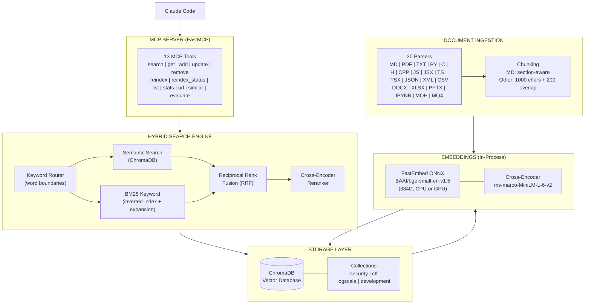
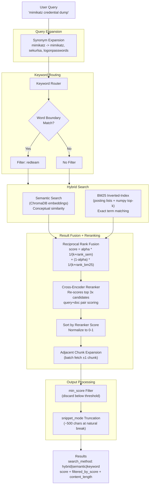
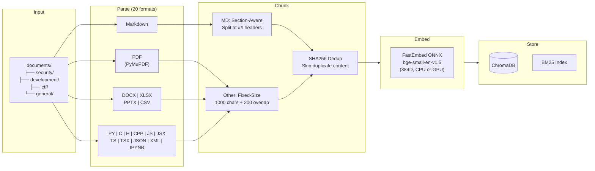
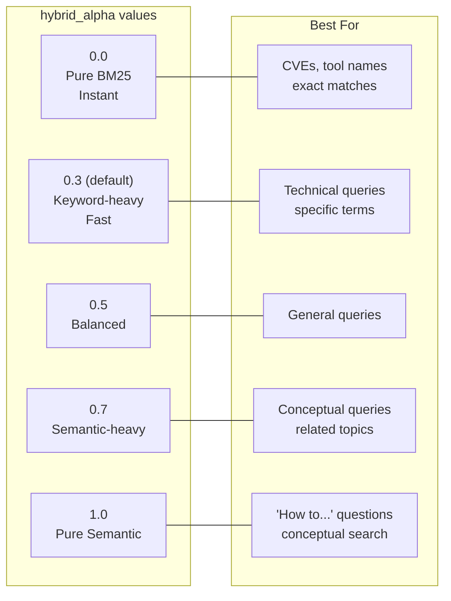

# Knowledge RAG

<div align="center">

[](https://pypi.org/project/knowledge-rag/)
[](https://www.npmjs.com/package/knowledge-rag)
[](https://pepy.tech/projects/knowledge-rag)


[](https://github.com/lyonzin/knowledge-rag/actions/workflows/ci.yml)
[](https://github.com/lyonzin/knowledge-rag/actions/workflows/security.yml)
[](https://github.com/lyonzin/knowledge-rag/actions/workflows/quality-gate.yml)
[](https://glama.ai/mcp/servers/lyonzin/knowledge-rag)

### Your docs, your machine, zero cloud. Claude Code searches them natively.

Drop your PDFs, markdown, code, notebooks — **1800+ files, 39K chunks, indexed in under 3 minutes.**<br/>
Hybrid search (BM25 + semantic vectors + cross-encoder reranking) through 13 MCP tools.<br/>
Everything runs locally via ONNX. No Docker, no Ollama, no API keys, no data leaves your machine.

```
pip install knowledge-rag → restart Claude Code → search_knowledge("your query")
```

---

**13 MCP Tools** | **Hybrid Search + Reranking** | **20 File Formats** | **Optional NVIDIA GPU** | **100% Local**

[What's New](#whats-new-in-v420) | [Supported Formats](#supported-formats) | [Installation](#installation) | [Configuration](#configuration) | [API Reference](#api-reference) | [Architecture](#architecture)

</div>

---

## Star History

<div align="center">

<a href="https://www.star-history.com/?repos=lyonzin%2Fknowledge-rag&type=date&legend=top-left">
 <picture>
   <source media="(prefers-color-scheme: dark)" srcset="https://api.star-history.com/chart?repos=lyonzin/knowledge-rag&type=date&theme=dark&legend=top-left" />
   <source media="(prefers-color-scheme: light)" srcset="https://api.star-history.com/chart?repos=lyonzin/knowledge-rag&type=date&legend=top-left" />
   
 </picture>
</a>

</div>

---

## What's New in v4.2.0

### Search Performance & Output Quality (v4.2.0)

**128× faster BM25 search** — replaced `rank-bm25` full-corpus scan with a custom **inverted-index** implementation. Only documents containing query terms are scored, using `numpy.argpartition` for O(n) top-k selection. Adjacent chunk fetching now uses a single batched ChromaDB call instead of N round-trips, and an O(1) reverse lookup (`_source_to_docid`) eliminates linear scans.

**Smarter output** — two new parameters on `search_knowledge`:
- **`snippet_mode`** (default: `true`) — truncates content to ~500 characters at natural break points, reducing token consumption by ~72%. Adds `content_length` field with original size; use `get_document()` for full content.
- **`min_score`** — filters results below a normalized relevance threshold (0.0–1.0). Eliminates low-quality noise from results. Response includes `filtered_by_score` count for transparency.

Both parameters are fully backwards-compatible (existing callers see no change in behavior).

### Enterprise Concurrent Access — SSE/HTTP Transport (v4.0.0)

The server now supports **SSE** and **streamable-http** transport modes. Instead of spawning a separate process per client (stdio), a single server process serves all clients with shared resources — 1 embedding model, 1 ChromaDB, 1 query cache.

```yaml
# config.yaml
server:
  transport: "sse"        # "stdio" | "sse" | "streamable-http"
  host: "127.0.0.1"
  port: 8179
```

Or via CLI: `knowledge-rag --transport sse`

**Optional enterprise features** (all disabled by default):
- **Rate limiting**: Sliding-window counter, configurable RPM and burst
- **Prometheus metrics**: `/metrics` endpoint on separate port
- **Bearer auth**: Token validation for SSE/HTTP connections

All 13 MCP tools are instrumented with `@rate_limited` and `@instrument` decorators — zero overhead when features are disabled. Default transport remains **stdio** for full backwards compatibility.

> **Migration**: Existing users need zero changes. SSE mode is opt-in via `server.transport: "sse"` in config.yaml. See [Configuration](#configuration) for details.

### Quality Gate — 7-Pillar PR Validation

Every PR (including dependabot bumps and one-line fixes) is now evaluated against **35+ automated checks** spread across 7 pillars before any human review:

| Pillar | What it enforces | Tools |
|---|---|---|
| **1 Security** | SAST, secrets, CVEs, supply chain | bandit, semgrep, gitleaks, pip-audit, dependency-review, Snyk, CodeQL, Socket |
| **2 Stability** | Flake detection, coverage trend, test count, deterministic runs | pytest-rerunfailures, codecov ±0.5pp, test-count guard |
| **3 Memory Leak** | RSS bounded under 1000-query load, no idle bloat | psutil-based baseline tests + nightly 50K-iteration soak |
| **4 Versatility** | 9 OS×Python combos, 14 format parsers, 4 config presets, locale tolerance, property-based fuzzing | matrix CI on Linux+Windows+macOS × 3.11+3.12+3.13, Hypothesis |
| **5 Scalability** | Performance regression > 10% blocks merge, public bench dashboard | pytest-benchmark, GH Pages chart |
| **6 Versioning** | Atomic version sync, API surface diff, conventional commits, CHANGELOG enforcement, backwards compat | griffe-style AST diff, custom guards |
| **7 Quality** | Type strictness, docstring coverage, complexity, dead code | mypy strict, interrogate ≥80%, radon, vulture |

Plus a **nightly resilience workflow** that runs chaos failure-injection (HF down, ChromaDB corruption, watchdog crash, ONNX zero-byte replay), determinism check (full suite × 3), and mutation testing on selected modules.

Read the full philosophy in [CONTRIBUTING.md](CONTRIBUTING.md). Report bugs via [SECURITY.md](SECURITY.md) or the [issue templates](.github/ISSUE_TEMPLATE/).

### Critical Hotfix — No More Silent Zero-Vector Corruption (v3.8.1)

`FastEmbedEmbeddings.__call__` no longer swallows exceptions and returns `[[0.0]*dim, ...]` when the ONNX model fails to load. That bug pre-existed in master but was silent: ChromaDB happily stored zero embeddings, `count()` reported normal numbers, smart-reindex skipped them as "already indexed", and queries returned garbage similarity with no error visible. Now raises `EmbeddingModelLoadError` / `EmbeddingError` loudly. **All v3.8.0 users should upgrade.** Full details in [Changelog](#v381-2026-05-10--hotfix).

### Lazy-Loaded Embeddings — Cheaper Idle Processes (v3.8.0)

The FastEmbed ONNX model (~200MB resident) now loads on the **first query**, not at startup. Idle `knowledge-rag` processes are now genuinely cheap. Why this matters: MCP stdio is one-process-per-client by protocol — multiple Claude Code windows, Claude Desktop + IDE simultaneously, or review/approval flows that open extra connections all spawn their own processes. Before v3.8.0, every one of them paid the full embedding-model cost up front. Now only processes that actually serve queries load the model. Public API is unchanged.

### Opt-In Single-Instance Guard (v3.8.0)

For users who measured their setup and want a hard cap of one server per `data_dir`:

```bash
export KNOWLEDGE_RAG_SINGLE_INSTANCE=1
```

A second instance exits immediately with code 75. **OFF by default** so multi-client MCP usage continues to work unchanged. Stale-PID recovery + SIGINT/SIGTERM cleanup wired correctly. Full guide in [docs/single-instance.md](docs/single-instance.md). Sample MCP config in [examples/mcp-config-single-instance.json](examples/mcp-config-single-instance.json).

### 5 Ways to Install

```bash
npx -y knowledge-rag                    # NPM — zero setup, auto-manages Python venv
pip install knowledge-rag               # PyPI — classic Python install
curl -fsSL .../install.sh | bash        # One-line installer (Linux/macOS/Windows)
docker pull ghcr.io/lyonzin/knowledge-rag  # Docker — models pre-downloaded
git clone ... && pip install -r ...     # From source
```

All methods produce the same MCP server. See [Installation](#installation) for full instructions.

### Recent Highlights

- **v4.0.0** — **Enterprise concurrent access**: SSE/HTTP transport (1 server → N clients), thread-safe shared state, optional rate limiting + Prometheus metrics, ChromaDB WAL mode, `--transport` CLI
- **v3.9.0** — **Quality Gate** activated: 35+ automated PR checks across 7 pillars (Security, Stability, Memory Leak, Versatility, Scalability, Versioning, Quality) + nightly resilience suite (chaos, soak, determinism, mutation)
- **v3.8.1** — Critical hotfix: loud-fail embeddings (no more silent zero-vector corruption); Windows CI flake erradicated (HF_HUB_OFFLINE + shell:bash + atexit wrapper)
- **v3.8.0** — Lazy-load embeddings, opt-in single-instance guard, version sync across PyPI/NPM/Docker
- **v3.6.0** — Multi-language code parsing (C/C++/JS/TS/XML), NPM wrapper, Docker image, automated release pipeline
- **v3.5.2** — CUDA DLL auto-discovery from pip packages, graceful GPU→CPU fallback, explicit CPU provider (no CUDA noise when `gpu: false`), BASE_DIR resolution fix for editable installs
- **v3.5.1** — Remove Python `<3.13` upper bound — 3.13 and 3.14 now supported
- **v3.5.0** — Optional GPU acceleration, supported formats table, full README rewrite
- **v3.4.3** — MCP stdout save/restore fix (v3.4.2 broke JSON-RPC responses)
- **v3.4.0** — Persistent model cache, exclude patterns, Jupyter Notebook parser, inotify resilience, MetaTrader support

See [Changelog](#changelog) for full history.

---

## Supported Formats

| Format | Extension | Parser | Default | Notes |
|--------|-----------|--------|---------|-------|
| Markdown | `.md` | Section-aware (splits at `##`) | Yes | Headers preserved as chunk boundaries |
| Plain Text | `.txt` | Fixed-size chunking | Yes | 1000 chars + 200 overlap |
| PDF | `.pdf` | PyMuPDF extraction | Yes | Text-based PDFs only (no OCR) |
| Python | `.py` | Code-aware parser | Yes | Functions/classes as chunks |
| JSON | `.json` | Structure-aware | Yes | Flattened key-value extraction |
| CSV | `.csv` | Row-based parser | Yes | Headers + rows as text |
| Word | `.docx` | python-docx | Yes | Headings preserved as markdown |
| Excel | `.xlsx` | openpyxl | Yes | Sheet-by-sheet extraction |
| PowerPoint | `.pptx` | python-pptx | Yes | Slide-by-slide extraction |
| Jupyter Notebook | `.ipynb` | Cell-aware parser | Yes | Markdown + code cells only, no outputs/base64 |
| C Source | `.c` | Code-aware parser | Yes | Functions/structs/includes extracted |
| C/C++ Header | `.h` | Code-aware parser | Yes | Function declarations/structs extracted |
| C++ Source | `.cpp` | Code-aware parser | Yes | Classes/structs/includes extracted |
| JavaScript | `.js` | Code-aware parser | Yes | Functions/classes/imports (ESM + CJS) |
| React JSX | `.jsx` | Code-aware parser | Yes | Same as JS parser |
| TypeScript | `.ts` | Code-aware parser | Yes | Functions/classes/interfaces/enums/imports |
| React TSX | `.tsx` | Code-aware parser | Yes | Same as TS parser |
| XML | `.xml` | XML parser | Yes | Root element and namespace extraction |
| MQL4 Header | `.mqh` | Code parser | No | MetaTrader — add to `supported_formats` to enable |
| MQL4 Source | `.mq4` | Code parser | No | MetaTrader — add to `supported_formats` to enable |

> **Tip:** The parser dispatch is extensible. Any format mapped in `_parsers` can be enabled via `supported_formats` in config.yaml.

---

## Features

| Feature | Description |
|---------|-------------|
| **Hybrid Search** | Semantic + BM25 keyword search with Reciprocal Rank Fusion |
| **Cross-Encoder Reranker** | Xenova/ms-marco-MiniLM-L-6-v2 re-scores top candidates for precision |
| **GPU Acceleration** | Optional ONNX CUDA support for 5-10x faster indexing |
| **YAML Configuration** | Fully customizable via `config.yaml` with domain-specific presets |
| **Query Expansion** | Configurable synonym mappings (69 security-term defaults) |
| **Markdown-Aware Chunking** | `.md` files split by `##`/`###` sections instead of fixed windows |
| **In-Process Embeddings** | FastEmbed ONNX Runtime (BAAI/bge-small-en-v1.5, 384D) |
| **Keyword Routing** | Word-boundary aware routing for domain-specific queries |
| **20 Format Parsers** | MD, TXT, PDF, PY, C, H, CPP, JS, JSX, TS, TSX, JSON, XML, CSV, DOCX, XLSX, PPTX, IPYNB + opt-in MQH/MQ4 |
| **Category Organization** | Organize docs by folder, auto-tagged by path |
| **Incremental Indexing** | Change detection via mtime/size — only re-indexes modified files |
| **Chunk Deduplication** | SHA256 content hashing prevents duplicate chunks |
| **Query Cache** | LRU cache with 5-min TTL for instant repeat queries |
| **Document CRUD** | Add, update, remove documents via MCP tools |
| **URL Ingestion** | Fetch URLs, strip HTML, convert to markdown, index |
| **Similarity Search** | Find documents similar to a reference document |
| **Retrieval Evaluation** | Built-in MRR@5 and Recall@5 metrics |
| **File Watcher** | Auto-reindex on document changes via watchdog (5s debounce) |
| **Exclude Patterns** | Glob-based file/directory exclusion during indexing |
| **MMR Diversification** | Maximal Marginal Relevance reduces redundant results |
| **Persistent Model Cache** | Embedding models cached in `models_cache/` — survives reboots |
| **Auto-Migration** | Detects embedding dimension mismatch and rebuilds automatically |
| **13 MCP Tools** | Full CRUD + search + evaluation via Claude Code |

---

## Architecture

### System Overview



### Query Processing Flow



### Document Ingestion Flow



### hybrid_alpha Parameter Effect



---

## Installation

### Prerequisites

- Python 3.11+
- Claude Code CLI
- *…or any other MCP client (Claude Desktop, Cursor, VS Code, Antigravity, opencode, Windsurf) — see [Use with other MCP clients](#use-with-other-mcp-clients)*
- ~200MB disk for model cache (auto-downloaded on first run)
- *Optional:* NVIDIA GPU + CUDA 12 for accelerated embeddings (see [GPU Acceleration](#gpu-acceleration) below)

### GPU Acceleration

GPU mode accelerates embedding generation during indexing and search. It requires an NVIDIA GPU with CUDA 12 support. No GPU? No problem — the server runs on CPU by default and GPU is entirely optional.

**Requirements:**

| Component | Minimum | How to check / get it |
|-----------|---------|----------------------|
| NVIDIA GPU (Turing+) | RTX 20xx / 30xx / 40xx / 50xx, or Tesla T4+ | `nvidia-smi` |
| NVIDIA Driver | ≥ 525 | `nvidia-smi` — [nvidia.com/drivers](https://www.nvidia.com/drivers) |
| CUDA 12 runtime | Provided by pip packages below | Automatic |

**Setup (2 steps):**

```bash
# 1. Install GPU dependencies (onnxruntime-gpu + all CUDA 12 runtime DLLs)
pip install knowledge-rag[gpu]

# 2. Enable in config.yaml
# models:
#   embedding:
#     gpu: true
```

The `[gpu]` extra installs `onnxruntime-gpu` plus 7 NVIDIA CUDA 12 packages (`cublas`, `cudnn`, `cuda-runtime`, `cufft`, `cusparse`, `cusolver`, `curand`, `nvjitlink`) so you don't need a full CUDA Toolkit install.

**Verify GPU is active:**

On server startup, look for the GPU status banner:
```
============================================================
  GPU STATUS: ACTIVE
  Provider:   CUDAExecutionProvider
  Device:     NVIDIA GeForce RTX 3080 Ti
  VRAM:       12.0 GB
============================================================
```

Or programmatically:
```bash
python -c "import onnxruntime; print(onnxruntime.get_available_providers())"
# Should include: 'CUDAExecutionProvider'
```

> **Fallback**: If CUDA is unavailable at runtime (wrong driver, missing DLLs, no GPU), the server falls back to CPU automatically with a `[WARN]` log — it never crashes. The `gpu: true` config is a preference, not a requirement.

### Install Methods

Pick one — all produce the same running server.

#### Option A: NPX (fastest)

Requires Node.js 16+. Handles Python venv, pip install, and version upgrades automatically.

```bash
claude mcp add knowledge-rag -s user -- npx -y knowledge-rag
```

That's it. On first run, `npx` creates a venv at `~/.knowledge-rag/`, installs the PyPI package, and starts the MCP server. Subsequent runs reuse the cached venv.

#### Option B: One-line installer

```bash
# Linux/macOS:
curl -fsSL https://raw.githubusercontent.com/lyonzin/knowledge-rag/master/install.sh | bash

# Windows (PowerShell):
irm https://raw.githubusercontent.com/lyonzin/knowledge-rag/master/install.ps1 | iex
```

Then configure Claude Code:

```bash
claude mcp add knowledge-rag -s user -- ~/knowledge-rag/venv/bin/python -m mcp_server.server
```

> **Windows**: `claude mcp add knowledge-rag -s user -- %USERPROFILE%\knowledge-rag\venv\Scripts\python.exe -m mcp_server.server`

#### Option C: pip install

```bash
mkdir ~/knowledge-rag && cd ~/knowledge-rag
python3 -m venv venv && source venv/bin/activate
pip install knowledge-rag
knowledge-rag init              # Exports config template, presets, creates documents/
```

Then configure Claude Code:

```bash
claude mcp add knowledge-rag -s user -- ~/knowledge-rag/venv/bin/python -m mcp_server.server
```

> **Windows users**: Use `python` instead of `python3`, `venv\Scripts\activate` instead of `source venv/bin/activate`.
> **Windows path**: `claude mcp add knowledge-rag -s user -- %USERPROFILE%\knowledge-rag\venv\Scripts\python.exe -m mcp_server.server`

#### Option D: Clone from source

```bash
git clone https://github.com/lyonzin/knowledge-rag.git ~/knowledge-rag
cd ~/knowledge-rag
python3 -m venv venv && source venv/bin/activate
pip install -r requirements.txt
```

Then configure Claude Code:

```bash
claude mcp add knowledge-rag -s user -- ~/knowledge-rag/venv/bin/python -m mcp_server.server
```

#### Option E: Docker

```bash
docker pull ghcr.io/lyonzin/knowledge-rag:latest
```

```bash
claude mcp add knowledge-rag -s user -- \
  docker run -i --rm \
  -v ~/knowledge-rag/documents:/app/documents \
  -v ~/knowledge-rag/data:/app/data \
  ghcr.io/lyonzin/knowledge-rag:latest
```

Models are pre-downloaded in the image — no first-run delay.

<details>
<summary>Alternative: manual JSON config</summary>

Add to `~/.claude.json`:

**Windows:**
```json
{
  "mcpServers": {
    "knowledge-rag": {
      "command": "C:\\Users\\YOUR_USER\\knowledge-rag\\venv\\Scripts\\python.exe",
      "args": ["-m", "mcp_server.server"]
    }
  }
}
```

**Linux / macOS:**
```json
{
  "mcpServers": {
    "knowledge-rag": {
      "command": "/home/YOUR_USER/knowledge-rag/venv/bin/python",
      "args": ["-m", "mcp_server.server"]
    }
  }
}
```
> Replace `YOUR_USER` with your username, or use the full path from `echo $HOME`.
</details>

#### Option F: SSE Server Mode (multi-agent)

For multi-agent setups where multiple clients query the same knowledge base simultaneously:

```bash
pip install knowledge-rag[server]    # Adds uvicorn for SSE/HTTP
knowledge-rag --transport sse        # Starts on http://127.0.0.1:8179
```

Then configure each MCP client to connect via SSE:

```json
{
  "mcpServers": {
    "knowledge-rag": {
      "type": "sse",
      "url": "http://127.0.0.1:8179/sse"
    }
  }
}
```

One server process serves all agents — shared embedding model, shared cache, shared ChromaDB. See [Configuration > Server](#server) for rate limiting, metrics, and auth options.

### Use with other MCP clients

`knowledge-rag` supports both **stdio** (default, 1:1) and **SSE** (1:N) transport modes. In stdio mode, it works with any MCP-compatible client, not only Claude Code. The launch command is the same everywhere (the `python -m mcp_server.server` from whichever install method you picked); only the **config file location** and **JSON shape** differ per client.

#### Clients using the standard `mcpServers` format

For **Claude Desktop, Cursor, Antigravity, and Windsurf**, use the same block — only the file location changes:

```json
{
  "mcpServers": {
    "knowledge-rag": {
      "command": "/home/YOUR_USER/knowledge-rag/venv/bin/python",
      "args": ["-m", "mcp_server.server"]
    }
  }
}
```

> **Windows**: set `command` to the full path of `venv\Scripts\python.exe`.

| Client | Config file | Notes |
|---|---|---|
| **Claude Code** | use `claude mcp add …` (see install methods above) | The CLI writes `~/.claude.json` for you — manual edits to it aren't reliably picked up. |
| **Claude Desktop** | macOS: `~/Library/Application Support/Claude/claude_desktop_config.json` · Windows: `%APPDATA%\Claude\claude_desktop_config.json` | Easiest: **Settings → Developer → Edit Config** opens the correct file (avoids the Windows Store/MSIX path quirk). |
| **Cursor** | `~/.cursor/mcp.json` (global) or `.cursor/mcp.json` (per project) | — |
| **Antigravity** | macOS/Linux: `~/.gemini/antigravity/mcp_config.json` · Windows: `%USERPROFILE%\.gemini\antigravity\mcp_config.json` | Open via Agent panel → **"…" → Manage MCP Servers → View raw config**. |
| **Windsurf** | `~/.codeium/windsurf/mcp_config.json` (global only) | Easiest: Cascade panel → MCP → **View raw config**. |

#### VS Code — uses a `servers` key

VS Code (Copilot MCP) nests servers under **`servers`**, not `mcpServers`. Put this in `.vscode/mcp.json` (workspace) or the file opened by the **MCP: Open User Configuration** command:

```json
{
  "servers": {
    "knowledge-rag": {
      "type": "stdio",
      "command": "/home/YOUR_USER/knowledge-rag/venv/bin/python",
      "args": ["-m", "mcp_server.server"]
    }
  }
}
```

#### opencode — uses an `mcp` key

opencode nests servers under **`mcp`**, takes `command` as a single **array**, and uses `environment` instead of `env`. Put this in `opencode.json` (project root) or `~/.config/opencode/opencode.json` (global):

```jsonc
{
  "$schema": "https://opencode.ai/config.json",
  "mcp": {
    "knowledge-rag": {
      "type": "local",
      "command": ["/home/YOUR_USER/knowledge-rag/venv/bin/python", "-m", "mcp_server.server"],
      "enabled": true
    }
  }
}
```

> **Any other MCP client**: point it at the same command + args (`…/venv/bin/python -m mcp_server.server`). If it speaks stdio MCP, knowledge-rag works — only the config file's location and key naming differ. Check your client's docs for the exact path.

### Verify

```bash
claude mcp list
```

On first start, the server will:
1. Download the embedding model (~50MB, cached in `models_cache/`)
2. Auto-index any documents in the `documents/` directory
3. Start watching for file changes (auto-reindex)

---

## Usage

### Adding Documents

Place your documents in the `documents/` directory, organized by category:

```
documents/
├── security/          # Pentest, exploit, vulnerability docs
├── development/       # Code, APIs, frameworks
├── ctf/               # CTF writeups and methodology
├── logscale/          # LogScale/LQL documentation
└── general/           # Everything else
```

Or add documents programmatically via MCP tools:

```python
# Add from content
add_document(
    content="# My Document\n\nContent here...",
    filepath="security/my-technique.md",
    category="security"
)

# Add from URL
add_from_url(
    url="https://example.com/article",
    category="security",
    title="Custom Title"
)
```

### Searching

Claude uses the RAG system automatically when configured. You can also control search behavior:

```python
# Pure keyword search — instant, no embedding needed
search_knowledge("gtfobins suid", hybrid_alpha=0.0)

# Keyword-heavy (default) — fast, slight semantic boost
search_knowledge("mimikatz", hybrid_alpha=0.3)

# Balanced hybrid — both engines equally weighted
search_knowledge("SQL injection techniques", hybrid_alpha=0.5)

# Semantic-heavy — better for conceptual queries
search_knowledge("how to escalate privileges", hybrid_alpha=0.7)

# Pure semantic — embedding similarity only
search_knowledge("lateral movement strategies", hybrid_alpha=1.0)
```

### Indexing

Documents are automatically indexed on first startup. All reindex operations run **in background** — they return immediately and you poll progress via `get_reindex_status()`:

```python
# Incremental: only re-index changed files (fast)
reindex_documents()

# Smart reindex: detect changes + rebuild BM25
reindex_documents(force=True)

# Nuclear rebuild: delete everything, re-embed all (use after model change)
reindex_documents(full_rebuild=True)

# Poll progress (lightweight, no full stats computation)
get_reindex_status()
# → {"reindex": {"active": true, "percent": 56, "progress": "2090/3734", ...}}
```

### Evaluating Retrieval Quality

```python
evaluate_retrieval(test_cases='[
    {"query": "sql injection", "expected_filepath": "security/sqli-guide.md"},
    {"query": "privilege escalation", "expected_filepath": "security/privesc.md"}
]')
# Returns: MRR@5, Recall@5, per-query results
```

---

## API Reference

### Search & Query

#### `search_knowledge`

Hybrid search combining semantic search + BM25 keyword search with cross-encoder reranking.

| Parameter | Type | Default | Description |
|-----------|------|---------|-------------|
| `query` | string | required | Search query text (1-3 keywords recommended) |
| `max_results` | int | 5 | Maximum results to return (1-20) |
| `category` | string | null | Filter by category |
| `hybrid_alpha` | float | 0.3 | Balance: 0.0 = keyword only, 1.0 = semantic only |
| `min_score` | float | 0.0 | Minimum relevance score (0.0-1.0) to include a result. Use 0.2-0.4 to cut noise |
| `snippet_mode` | bool | true | Truncate content to ~500 chars at natural break points. Adds `content_length` field |

**Returns:**

```json
{
  "status": "success",
  "query": "mimikatz credential dump",
  "hybrid_alpha": 0.5,
  "result_count": 3,
  "filtered_by_score": 2,
  "cache_hit_rate": "0.0%",
  "results": [
    {
      "content": "Mimikatz can extract credentials from memory...",
      "source": "documents/security/credential-attacks.md",
      "filename": "credential-attacks.md",
      "category": "security",
      "score": 0.9823,
      "raw_rrf_score": 0.016393,
      "reranker_score": 0.987654,
      "semantic_rank": 2,
      "bm25_rank": 1,
      "search_method": "hybrid",
      "keywords": ["mimikatz", "credential", "lsass"],
      "routed_by": "redteam"
    }
  ]
}
```

**Search Method Values:**
- `hybrid`: Found by both semantic and BM25 search (highest confidence)
- `semantic`: Found only by semantic search
- `keyword`: Found only by BM25 keyword search

---

#### `get_document`

Retrieve the full content of a specific document.

| Parameter | Type | Description |
|-----------|------|-------------|
| `filepath` | string | Path to the document file |

**Returns:** JSON with document content, metadata, keywords, and chunk count.

---

#### `reindex_documents`

Index or reindex all documents in the knowledge base. **Runs in background** — returns immediately. Poll progress via `get_reindex_status()`.

| Parameter | Type | Default | Description |
|-----------|------|---------|-------------|
| `force` | bool | false | Smart reindex: detects changes, rebuilds BM25. Fast. |
| `full_rebuild` | bool | false | Nuclear rebuild: deletes everything, re-embeds all documents. Use after model change. |

**Returns:** `{"status": "started", "operation": "..."}` immediately. If already running, returns `{"status": "already_running", "progress": "1200/3734"}`.

---

#### `get_reindex_status`

Get the current status of a background reindex operation. Lightweight — does not compute full index statistics.

**Returns (active):**
```json
{
  "status": "success",
  "reindex": {
    "active": true,
    "operation": "nuclear_rebuild",
    "progress": "1200/3734",
    "percent": 32,
    "indexed": 1200,
    "skipped": 0,
    "errors": 0,
    "started_at": "2026-06-17T18:29:49"
  }
}
```

**Returns (idle):** `{"status": "success", "reindex": {"active": false}}`

---

#### `list_categories`

List all document categories with their document counts.

**Returns:**

```json
{
  "status": "success",
  "categories": {
    "security": 52,
    "development": 8,
    "ctf": 12,
    "general": 3
  },
  "total_documents": 75
}
```

---

#### `list_documents`

List all indexed documents, optionally filtered by category.

| Parameter | Type | Description |
|-----------|------|-------------|
| `category` | string | Optional category filter |

**Returns:** JSON array of documents with id, source, category, format, chunks, and keywords.

---

#### `get_index_stats`

Get statistics about the knowledge base index.

**Returns:**

```json
{
  "status": "success",
  "stats": {
    "total_documents": 75,
    "total_chunks": 9256,
    "categories": {"security": 52, "development": 8},
    "supported_formats": [".md", ".txt", ".pdf", ".py", ".json", ".docx", ".xlsx", ".pptx", ".csv", ".ipynb"],
    "embedding_model": "BAAI/bge-small-en-v1.5",
    "embedding_dim": 384,
    "reranker_model": "Xenova/ms-marco-MiniLM-L-6-v2",
    "chunk_size": 1000,
    "chunk_overlap": 200,
    "query_cache": {
      "size": 12,
      "max_size": 100,
      "ttl_seconds": 300,
      "hits": 45,
      "misses": 23,
      "hit_rate": "66.2%"
    }
  }
}
```

---

### Document Management

#### `add_document`

Add a new document to the knowledge base from raw content. Saves the file to the documents directory and indexes it immediately.

| Parameter | Type | Default | Description |
|-----------|------|---------|-------------|
| `content` | string | required | Full text content of the document |
| `filepath` | string | required | Relative path within documents dir (e.g., `security/new-technique.md`) |
| `category` | string | "general" | Document category |

---

#### `update_document`

Update an existing document. Removes old chunks from the index and re-indexes with new content.

| Parameter | Type | Description |
|-----------|------|-------------|
| `filepath` | string | Full path to the document file |
| `content` | string | New content for the document |

---

#### `remove_document`

Remove a document from the knowledge base index. Optionally deletes the file from disk.

| Parameter | Type | Default | Description |
|-----------|------|---------|-------------|
| `filepath` | string | required | Path to the document file |
| `delete_file` | bool | false | If true, also delete the file from disk |

---

#### `add_from_url`

Fetch content from a URL, strip HTML (scripts, styles, nav, footer, header), convert to markdown, and add to the knowledge base.

| Parameter | Type | Default | Description |
|-----------|------|---------|-------------|
| `url` | string | required | URL to fetch content from |
| `category` | string | "general" | Document category |
| `title` | string | null | Custom title (auto-detected from `<title>` tag if not provided) |

---

#### `search_similar`

Find documents similar to a given document using embedding similarity.

| Parameter | Type | Default | Description |
|-----------|------|---------|-------------|
| `filepath` | string | required | Path to the reference document |
| `max_results` | int | 5 | Number of similar documents to return (1-20) |

---

#### `evaluate_retrieval`

Evaluate retrieval quality with test queries. Useful for tuning `hybrid_alpha`, testing query expansion effectiveness, or validating after reindexing.

| Parameter | Type | Description |
|-----------|------|-------------|
| `test_cases` | string (JSON) | Array of test cases: `[{"query": "...", "expected_filepath": "..."}, ...]` |

**Metrics:**
- **MRR@5** (Mean Reciprocal Rank): Average of 1/rank for expected documents. 1.0 = always first result.
- **Recall@5**: Fraction of expected documents found in top 5 results. 1.0 = all found.

---

## Configuration

Knowledge RAG is fully configurable via a `config.yaml` file in the project root. If no `config.yaml` exists, sensible defaults are used — the system works out of the box with zero configuration.

### Quick Start

```bash
# Option 1: Use a preset
cp presets/cybersecurity.yaml config.yaml    # Offensive/defensive security, CTFs
cp presets/developer.yaml config.yaml        # Software engineering, APIs, DevOps
cp presets/research.yaml config.yaml         # Academic research, papers, studies
cp presets/general.yaml config.yaml          # Blank slate, pure semantic search

# Option 2: Start from the documented template
cp config.example.yaml config.yaml
# Edit config.yaml to your needs
```

Restart Claude Code after changing `config.yaml`.

### config.yaml Structure

```yaml
# Paths — where your documents live
paths:
  documents_dir: "./documents"    # Scanned recursively
  data_dir: "./data"              # Index storage
  models_cache_dir: "./models_cache"  # Persistent embedding model cache

# Documents — what gets indexed and how
documents:
  supported_formats:              # File types to index
    - .md
    - .txt
    - .pdf
    - .docx
    - .ipynb
    # - .py                       # Uncomment to index code
  exclude_patterns:               # Glob patterns to skip
    - "node_modules"
    - ".venv"
    - "__pycache__"
  chunking:
    chunk_size: 1000              # Max chars per chunk
    chunk_overlap: 200            # Shared chars between chunks

# Models — AI models for search (all run locally, no API keys)
models:
  embedding:
    model: "BAAI/bge-small-en-v1.5"   # ONNX, ~33MB, auto-downloaded
    dimensions: 384
    gpu: false                         # Set true + pip install knowledge-rag[gpu]
  reranker:
    enabled: true                      # Falls back to RRF if model is unavailable
    model: "Xenova/ms-marco-MiniLM-L-6-v2"
    top_k_multiplier: 3               # Candidates fetched before reranking

# Search — result limits and collection name
search:
  default_results: 5
  max_results: 20
  collection_name: "knowledge_base"   # Change for separate knowledge bases

# Categories — auto-tag documents by folder path
# Set to {} to disable categorization entirely
category_mappings:
  "security/redteam": "redteam"
  "security/blueteam": "blueteam"
  "notes": "notes"

# Keyword routing — prioritize categories based on query keywords
# Set to {} for pure semantic search with no routing bias
keyword_routes:
  redteam:
    - pentest
    - exploit
    - privilege escalation

# Query expansion — expand abbreviations for better BM25 recall
# Set to {} for no expansion (search terms used as-is)
query_expansions:
  sqli:
    - sql injection
    - sqli
  privesc:
    - privilege escalation
    - privesc

# Server — enterprise features (new in v4.0.0)
server:
  transport: "stdio"              # "stdio" | "sse" | "streamable-http"
  host: "127.0.0.1"              # Bind address (SSE/HTTP only)
  port: 8179                      # Bind port (SSE/HTTP only)
  auth:
    bearer_token: ""              # Set a secret to enable auth (SSE/HTTP only)
  rate_limit:
    enabled: false
    requests_per_minute: 60
    burst: 10
  metrics:
    enabled: false
    port: 9179                    # Separate port for Prometheus scraping
```

> See `config.example.yaml` for the fully documented template with explanations for every field.

### Presets

Pre-built configurations for common use cases:

| Preset | File | Categories | Keywords | Expansions | Best For |
|--------|------|-----------|----------|-----------|----------|
| **Cybersecurity** | `presets/cybersecurity.yaml` | 8 | 200+ | 69 | Red/Blue Team, CTFs, threat hunting, exploit dev |
| **Developer** | `presets/developer.yaml` | 9 | 150+ | 50+ | Full-stack dev, APIs, DevOps, cloud, databases |
| **Research** | `presets/research.yaml` | 9 | 100+ | 40+ | Academic papers, thesis, lab notebooks, datasets |
| **General** | `presets/general.yaml` | 0 | 0 | 0 | Blank slate — pure semantic search, no domain logic |

**Creating your own preset**: Copy `config.example.yaml`, fill in your categories/keywords/expansions, save to `presets/your-domain.yaml`.

### Configuration Reference

#### Server

| Field | Default | Description |
|-------|---------|-------------|
| `server.transport` | `"stdio"` | Transport protocol: `"stdio"`, `"sse"`, or `"streamable-http"` |
| `server.host` | `"127.0.0.1"` | Bind address for SSE/HTTP mode |
| `server.port` | `8179` | Bind port for SSE/HTTP mode |
| `server.auth.bearer_token` | `""` (disabled) | Bearer token for SSE/HTTP auth. Empty = no auth |
| `server.rate_limit.enabled` | `false` | Enable per-client rate limiting |
| `server.rate_limit.requests_per_minute` | `60` | Max requests per minute |
| `server.rate_limit.burst` | `10` | Burst allowance above steady rate |
| `server.metrics.enabled` | `false` | Enable Prometheus `/metrics` endpoint |
| `server.metrics.port` | `9179` | Port for metrics scraping |

In stdio mode (default), server settings are ignored. SSE/HTTP mode auto-enables the single-instance lock.

#### Paths

| Field | Default | Description |
|-------|---------|-------------|
| `paths.documents_dir` | `./documents` | Root folder scanned recursively for documents |
| `paths.data_dir` | `./data` | Internal storage for ChromaDB and index metadata |
| `paths.models_cache_dir` | `./models_cache` | Persistent cache for embedding models (~250MB). Survives reboots |

Relative paths resolve from the project root. Absolute paths work too.

#### Documents

| Field | Default | Description |
|-------|---------|-------------|
| `documents.supported_formats` | .md .txt .pdf .py .json .docx .xlsx .pptx .csv .ipynb | File extensions to index |
| `documents.exclude_patterns` | `[]` (empty) | Glob patterns for files/dirs to skip during indexing |
| `documents.chunking.chunk_size` | 1000 | Max characters per chunk |
| `documents.chunking.chunk_overlap` | 200 | Characters shared between consecutive chunks |

**Chunking guidelines**: Short notes → 500/100. General use → 1000/200. Long technical docs → 1500/300.

For `.md` files, chunking splits at `##` and `###` header boundaries first. Sections larger than `chunk_size` are sub-chunked with overlap. Non-markdown files use fixed-size chunking.

#### Models

| Field | Default | Description |
|-------|---------|-------------|
| `models.embedding.model` | `BAAI/bge-small-en-v1.5` | Embedding model (ONNX, runs locally) |
| `models.embedding.dimensions` | 384 | Vector dimensions (must match model) |
| `models.embedding.gpu` | false | Enable CUDA GPU acceleration. See [GPU Acceleration](#gpu-acceleration) for full setup |
| `models.reranker.enabled` | true | Enable cross-encoder reranking |
| `models.reranker.model` | `Xenova/ms-marco-MiniLM-L-6-v2` | Reranker model |
| `models.reranker.top_k_multiplier` | 3 | Fetch N*multiplier candidates for reranking |

If the reranker model is not available locally and the machine cannot download it, search now falls back to the RRF order from hybrid semantic+BM25 retrieval. This keeps `search_knowledge` available offline, but result ordering may be less precise for ambiguous queries until the reranker model is cached.

**Embedding model options** (fastest → most accurate):
- `BAAI/bge-small-en-v1.5` — 384D, ~33MB (default)
- `BAAI/bge-base-en-v1.5` — 768D, ~130MB
- `BAAI/bge-large-en-v1.5` — 1024D, ~335MB
- `intfloat/multilingual-e5-small` — 384D, 100+ languages

> **Warning**: Changing the embedding model after indexing requires `reindex_documents(full_rebuild=True)`.

#### Search

| Field | Default | Description |
|-------|---------|-------------|
| `search.default_results` | 5 | Results returned when no limit specified |
| `search.max_results` | 20 | Hard cap even if client requests more |
| `search.collection_name` | `knowledge_base` | ChromaDB collection — change for separate KBs |

#### Categories

Map folder paths to category names. Documents in matching folders get auto-tagged, enabling filtered searches.

```yaml
category_mappings:
  "security/redteam": "redteam"
  "security": "security"
```

Set `category_mappings: {}` to disable — documents are still searchable, just without category filters.

#### Keyword Routing

Route queries to categories based on keywords. When a query contains listed keywords, results from that category are prioritized (not filtered — other categories still appear, ranked lower).

```yaml
keyword_routes:
  redteam:
    - pentest
    - exploit
    - sqli
```

Single-word keywords use regex word boundaries (`\b`) — "api" won't match "RAPID". Multi-word keywords use substring matching.

Set `keyword_routes: {}` for pure semantic search.

#### Query Expansion

Expand search terms with synonyms before BM25 search. Supports single tokens, bigrams, and full query matches.

```yaml
query_expansions:
  sqli:
    - sql injection
    - sqli
  k8s:
    - kubernetes
    - k8s
```

Set `query_expansions: {}` for no expansion.

`query_expansions` is directional: only the key on the left triggers the terms on the right. If you need mutual expansion without duplicating entries, use `query_expansion_groups`.

```yaml
query_expansion_groups:
  - ["triple barrier", "tb", "trip_barr"]
  - ["profit factor", "pf"]
```

Each group is interpreted symmetrically, so every term expands to the rest of the group. The final internal expansion table is built by merging both sources:

1. `query_expansions` entries are loaded as-is.
2. `query_expansion_groups` adds reciprocal links for every term in each group.
3. Overlaps are merged by union with duplicate terms removed.

This keeps backward compatibility while allowing concise synonym groups.

### Hybrid Search Tuning

| hybrid_alpha | Behavior | Best For |
|--------------|----------|----------|
| 0.0 | Pure BM25 keyword | Exact terms, CVEs, tool names |
| 0.3 | Keyword-heavy **(default)** | Technical queries with specific terms |
| 0.5 | Balanced | General queries |
| 0.7 | Semantic-heavy | Conceptual queries, related topics |
| 1.0 | Pure semantic | "How to..." questions, abstract concepts |

---

## Project Structure

```
knowledge-rag/
├── mcp_server/
│   ├── __init__.py          # Stdout protection + version
│   ├── config.py            # YAML config loader + defaults
│   ├── ingestion.py         # 20 parsers, chunking, metadata extraction
│   └── server.py            # MCP server, ChromaDB, BM25, reranker, 12 tools
├── config.example.yaml      # Documented config template (copy to config.yaml)
├── config.yaml              # Your active configuration (git-ignored)
├── presets/                  # Ready-to-use domain configurations
│   ├── cybersecurity.yaml
│   ├── developer.yaml
│   ├── research.yaml
│   └── general.yaml
├── documents/               # Your documents (scanned recursively)
├── data/
│   ├── chroma_db/           # ChromaDB vector database
│   └── index_metadata.json  # Incremental indexing state
├── models_cache/            # Persistent embedding model cache
├── tests/                   # Test suite (82 tests)
├── install.sh               # Linux/macOS installer
├── install.ps1              # Windows installer
├── venv/                    # Python virtual environment
├── requirements.txt
├── pyproject.toml
├── LICENSE
└── README.md
```

---

## Troubleshooting

### Python version mismatch

Requires Python 3.11 or newer.

```bash
python --version    # Must be 3.11+
```

### FastEmbed model download fails

On first run, FastEmbed downloads models to `models_cache/`. If the download fails:

```bash
# Clear cache and retry
# Windows:
rmdir /s /q models_cache

# Linux/macOS:
rm -rf models_cache

# Then restart the MCP server
```

### Reranker model download fails

The reranker is lazy-loaded on the first query. If the model is not cached and the machine is offline, search continues without reranking and uses the RRF order from hybrid retrieval. To keep reranking enabled offline, run one query while online or pre-populate `models_cache/` on the target machine.

You can still disable reranking explicitly in `config.yaml`:

```yaml
models:
  reranker:
    enabled: false
```

Disabling reranking reduces memory use and avoids first-query model loading. The tradeoff is lower ranking precision, especially when several chunks match the same terms but only one is the best answer.

### ChromaDB index crashes on startup

Native ChromaDB failures can terminate Python before normal exception handling runs. Startup now probes ChromaDB in a child process before initializing the MCP server. If the probe crashes, the active `chroma_db/` and `index_metadata.json` are moved to `data/backups/auto-repair-*`, and the next startup can rebuild a clean index.

The same guarded behavior is available through either console script:

```bash
knowledge-rag
knowledge-rag-guarded
```

### Index is empty

```bash
# Check documents directory has files
ls documents/

# Force reindex via Claude Code:
# reindex_documents(force=True)

# Or nuclear rebuild if model changed:
# reindex_documents(full_rebuild=True)
```

### MCP server not loading

1. Check `~/.claude.json` exists and has valid JSON in the `mcpServers` section
2. Verify paths use double backslashes (`\\`) on Windows
3. Restart Claude Code completely
4. Run `claude mcp list` to check connection status

### "Failed to connect" error

The MCP server uses stdout for JSON-RPC communication. If a library prints to stdout during init, the stream gets corrupted. v3.4.3+ includes stdout protection that prevents this. If you're on an older version, upgrade:

```bash
pip install --upgrade knowledge-rag
```

### Slow first query

The cross-encoder reranker model is lazy-loaded on the first query. This adds a one-time ~2-3 second delay for model download and loading. Subsequent queries are fast. If the model cannot be loaded, search falls back to RRF ordering and does not retry loading the reranker until the server restarts.

### Memory usage

With ~200 documents, expect ~300-500MB RAM. The embedding model (~200MB ONNX runtime resident, lazy-loaded on first query since v3.8.0) and reranker (~25MB, lazy-loaded) are loaded into memory only when actually used. For very large knowledge bases (1000+ documents), consider enabling GPU acceleration and using exclude patterns to limit index scope.

### Multiple MCP clients spawn duplicate servers

MCP stdio is one process per client by protocol — multiple Claude Code windows, Claude Desktop + IDE, etc. each spawn their own `knowledge-rag` process. Since v3.8.0 idle processes are cheap (no embedding model loaded until first query). If you've measured and want a hard cap of one server per data directory, opt in:

```bash
export KNOWLEDGE_RAG_SINGLE_INSTANCE=1
```

A second instance exits immediately with code 75. Default is OFF (multi-client friendly). Full guide: [docs/single-instance.md](docs/single-instance.md). Sample MCP config: [examples/mcp-config-single-instance.json](examples/mcp-config-single-instance.json).

### SSE server won't start

```bash
# Check if port 8179 is already in use
# Windows:
netstat -aon | findstr :8179
# Linux/macOS:
lsof -i :8179
```

If `uvicorn` is not found, install the server extras: `pip install knowledge-rag[server]`

### Can't connect to SSE server

Verify the server is running and the URL is correct:

```bash
curl http://127.0.0.1:8179/sse
```

Common issues:
- Wrong URL: must end with `/sse` (not just the port)
- Firewall blocking the port
- Server started with a different host/port than configured in the MCP client

---

## Changelog

### Unreleased

- **NEW**: Cross-platform, multi-LLM-client installer (`install.py`) driving both `install.sh` (Linux/macOS) and `install.ps1` (Windows) as thin wrappers. One codebase, one behavior across every OS.
- **NEW**: Auto-detects and registers `knowledge-rag` in 8 LLM clients — Claude Code, Claude Desktop, Cursor, Windsurf, VS Code (Copilot Chat), Cline, Gemini CLI, Zed — writing to each tool's canonical config path with the correct JSON schema per client (VS Code uses `servers`, Zed uses `context_servers`, everyone else uses `mcpServers`).
- **NEW**: `--for <clients>` / `--exclude <clients>` opt-in/opt-out selection, `--dry-run` preview, `--list-clients` registry inspection, `--pypi-version <ver>` pinning, `--skip-init` / `--skip-model` for fast reruns. See `python install.py --help`.
- **FIX**: `install.ps1` no longer writes MCP config to `~/.claude/mcp.json` (a stale secondary path); it now targets `~/.claude.json` — the file Claude Code actually reads — via idempotent JSON merge that preserves every existing MCP server entry with an automatic `.knowledge-rag.bak` backup.
- **FIX**: `install.ps1` gains PyPI mode (`pip install knowledge-rag`) and runs `mcp_server.server init` on install — feature parity with `install.sh`.
- **FIX**: MCP server spec no longer uses the fragile `cmd /c cd /d ... && python ...` wrapper on Windows; it emits the standard `command` + `cwd` shape supported natively by every modern client.
- **FIX**: `install.sh` guards against `sh install.sh` (bash-only features now emit a clear error instead of a cryptic syntax failure).
- **FIX**: Both scripts now correctly advertise **13 MCP tools** (was outdated at 12; `get_reindex_status` shipped in v4.3.0).
- **FIX**: Windows-side `install.ps1` prefers `winget install Python.Python.3.12 --scope user` (no admin), falls back to python.org 3.12.7 (was pinned to 3.12.0).
- **TEST**: New `tests/test_installer_no_data_loss.py` (22 tests) locks in the installer's zero-data-loss contract across all three JSON schemas (`mcpServers` / `servers` / `context_servers`): top-level keys preserved, sibling MCP servers byte-identical, `.knowledge-rag.bak` backup written before every mutation, idempotent second run, `--dry-run` writes nothing, atomic `os.replace` write. Baseline: 231 → 266.

### v4.3.1 (2026-06-22) — Hybrid Search Fixes

- **FIX**: Accept `"general"` as a valid category in `search_knowledge`. The parser hardcodes `"general"` as the fallback in `_detect_category` (`ingestion.py`), but the validator only built `valid_categories` from `config.keyword_routes` + `config.category_mappings.values()` — so users who customized `config.yaml` and dropped the default `"general": "general"` mapping hit `Invalid category` even though the index contained `general` documents. Validator now always tolerates `"general"`. (#98, thanks @Hohlas)
- **FIX**: Skip BM25-only search results when Chroma can no longer resolve the chunk ID. Stale BM25 indices (typically right after `remove_document` or in the window between async reindex and BM25 rebuild) returned hits whose `collection.get()` came back empty; the previous fallback inserted entries with `document=""` / `metadata={}` into the reranker, polluting results with empty matches. The pipeline now `continue`s past those, dropping the stale hit cleanly. (#98, thanks @Hohlas)
- **TEST**: Added `tests/test_pr98_regression.py` (4 tests) pinning both contracts so future refactors cannot silently revert either fix. Test count baseline: 227 → 231. (#99)
- **CI**: Bumped `[tool.mypy] python_version` from 3.11 to 3.12 to accept PEP 695 `type` statements in the numpy stub (`numpy/__init__.pyi`) which were breaking the Pillar 7 strict gate. Only affects static analysis; `requires-python = ">=3.11"` unchanged. (#100)

### v4.3.0 (2026-06-17) — Async Reindex, GPU CUDA 12, 13th MCP Tool

- **NEW**: `get_reindex_status` MCP tool — lightweight reindex progress polling without computing full index stats. Returns active/idle status, percent, processed/total, errors, and last result.
- **NEW**: `reindex_documents` now runs in background via daemon thread — returns immediately with `{"status": "started"}`. Eliminates MCP timeout on large document sets (5K+ files). Concurrent calls return `already_running` with current progress.
- **NEW**: GPU acceleration with full CUDA 12 support — `onnxruntime-gpu` + 7 NVIDIA pip packages (`cublas`, `cudnn`, `cuda-runtime`, `cufft`, `cusparse`, `cusolver`, `curand`, `nvjitlink`). Server auto-detects GPU on startup with 4-step verification (providers, DLLs, nvidia-smi, session creation). Falls back to CPU gracefully.
- **NEW**: `_setup_cuda_dll_paths()` adds NVIDIA pip package DLL directories to `PATH` automatically on Windows — onnxruntime finds CUDA 12 DLLs without a full CUDA Toolkit install.
- **DEPS**: `[gpu]` extra expanded from 3 to 8 packages (added `cufft`, `cusparse`, `cusolver`, `curand`, `nvjitlink`).
- **FIX**: GPU status reporting now uses actual ONNX session creation test instead of just checking `get_available_providers()` — prevents false "GPU ACTIVE" when CUDA DLLs are missing.
- **DOCS**: GPU Acceleration section rewritten with complete requirements table, setup steps, verification instructions, and fallback behavior.
- **DOCS**: Tool reference updated — `reindex_documents` async behavior documented, `get_reindex_status` reference added.
- **TEST**: Backwards-compat baseline updated for 13 MCP tools.

### v4.2.0 (2026-06-17) — Search Performance & Output Quality

- **PERF**: Custom inverted-index BM25 replaces `rank-bm25` full-corpus scan — 128× faster keyword search on 50K+ chunk corpora. Only documents containing query terms are scored via posting lists.
- **PERF**: `numpy.argpartition` for O(n) top-k selection instead of O(n log n) sort.
- **PERF**: Batched adjacent chunk fetch — single ChromaDB `collection.get()` call replaces N round-trips per result.
- **PERF**: O(1) reverse lookup via `_source_to_docid` dict eliminates linear scans of `_indexed_docs` in `search_similar`, `update_document`, `remove_document`, and `_expand_with_adjacent_chunks`.
- **NEW**: `snippet_mode` parameter on `search_knowledge` (default: `true`) — truncates content to ~500 chars at natural break points with `content_length` field. Reduces token consumption by ~72%.
- **NEW**: `min_score` parameter on `search_knowledge` (default: `0.0`) — filters results below a normalized relevance threshold. Response includes `filtered_by_score` count.
- **NEW**: `filtered_by_score` field in search response JSON for transparency.
- **DEPS**: `numpy` added as direct dependency (was transitive via fastembed); `rank-bm25` import removed from server.py.
- **TEST**: 6 new tests for `min_score` filtering and `snippet_mode` truncation.
- **TEST**: Updated backwards-compat baseline to include new `search_knowledge` parameters.

### v4.1.2 (2026-06-17)

- **FIX**: `_save_metadata` dict snapshot prevents concurrent modification crash during file watcher events.
- **STYLE**: ruff format applied to server.py.

### v4.1.1 (2026-06-17)

- **FIX**: All `_indexed_docs` iterations now use `list()` snapshot, preventing `dictionary changed size during iteration` crash when FileWatcher modifies the index concurrently with MCP tool calls (affects `search_knowledge`, `search_similar`, `update_document`, `remove_document`, `evaluate_retrieval`, `list_categories`, `list_documents`)

### v4.1.0 (2026-06-17)

- **Added:** `query_expansion_groups` config for symmetric synonym expansion (#92)
- **Improved:** `expand_query()` now returns deterministic expansion order (set → ordered list with dedup)

### v4.0.1 (2026-06-16)

- **FIX**: Orphan cleanup now runs before indexing loop, preventing chunk loss when files are moved (#90).
- **FIX**: Chunk deduplication is now per-document instead of global, preventing cross-document chunk deletion (#91).
- **FIX**: Added `on_moved` handler to `DocumentWatcher` for proper file move detection.
- **FIX**: Startup preflight probes ChromaDB in a child process and moves crashing persistent indexes to `data/backups/auto-repair-*` before MCP initialization.
- **FIX**: Reranker load failures now fall back to RRF ordering instead of failing `search_knowledge` on offline machines.
- **FIX**: Virtualenv project-root detection now handles Python symlinks that resolve to the system interpreter.
- **NEW**: `knowledge-rag-guarded` console script kept as an explicit guarded startup alias.

### v4.0.0 (2026-06-09) — Enterprise Concurrent Access

- **NEW**: SSE and streamable-http transport modes — 1 server serves N clients (`server.transport: "sse"` in config.yaml or `--transport sse` CLI).
- **NEW**: Thread-safe shared state for concurrent queries — QueryCache locking, BM25 build lock, orchestrator double-checked locking.
- **NEW**: ChromaDB WAL mode enabled automatically in SSE/HTTP mode for concurrent read performance.
- **NEW**: Optional rate limiting — sliding-window counter, configurable RPM and burst, disabled by default.
- **NEW**: Optional Prometheus metrics endpoint — tool call counts, latency histograms, separate port, disabled by default.
- **NEW**: All 13 MCP tools instrumented with `@rate_limited` and `@instrument` decorators (zero-cost when disabled).
- **NEW**: `--transport` CLI override for Docker/systemd deployments.
- **NEW**: `pip install knowledge-rag[server]` optional dependency for SSE/HTTP (uvicorn).
- **CHANGED**: SSE/HTTP mode auto-enables single-instance lock (port collision prevention).
- **CHANGED**: `mcp` dependency bumped to `>=1.6.0` (SSE/streamable-http support).
- **MIGRATION**: Default transport remains `stdio` — existing users need zero changes. See config.example.yaml for SSE setup.

### v3.9.1 (2026-06-08)

- **FIX**: Expand `~` in `config.yaml` path values (`documents_dir`, `data_dir`, `models_cache_dir`) via `expanduser()` on all platforms (#86).
- **FIX**: Warn when `documents_dir` resolves to a non-existent path instead of silently indexing zero files.
- **FIX**: File watcher now uses accumulate-mode debounce — bulk file copies no longer starve the reindex trigger.
- **FIX**: Concurrent `index_all()` calls are serialized via `_index_lock` to prevent ChromaDB SQLite corruption.
- **FIX**: `collection.add()` is batched (500 chunks/call) to cap memory usage during large reindex operations.
- **NEW**: `KNOWLEDGE_RAG_WATCHER_DISABLED=1` env var to disable the file watcher for troubleshooting.
- **NEW**: Progress logging every 10% for reindex operations with >100 documents.

### v3.9.0 (2026-05-10) — Quality Gate

**Major governance + CI hardening release. No runtime behavior change in `mcp_server/`. Public API surface unchanged from v3.8.1.**

- **NEW** Quality Gate workflow (`.github/workflows/quality-gate.yml`) enforcing the 7 pillars on every PR: Security, Stability, Memory Leak, Versatility, Scalability, Versioning, Quality. 35+ status checks total.
- **NEW** Nightly resilience workflow (`.github/workflows/nightly.yml`): chaos suite (failure injection), 1h soak test (50K-iteration loop), determinism check (full suite × 3), mutation testing (mutmut). Auto-opens GitHub issue on any nightly failure.
- **NEW** Performance benchmark suite under `bench/` (12 microbenchmarks, pytest-benchmark) with 10% regression gate on every PR.
- **NEW** Public performance dashboard via GitHub Pages (`.github/workflows/bench-pages.yml`) — chart of latency/throughput per commit. Dormant until repo Pages is enabled.
- **NEW** Property-based fuzzing of all parsers via Hypothesis (`tests/test_ingestion_property.py`) — 200 random examples per CI run.
- **NEW** Memory baseline regression tests (`tests/test_memory_baseline.py`, cross-platform via psutil) — RSS bounded under 1000 queries; nightly soak amplifies to 50K iterations.
- **NEW** Property/locale/format/preset matrices (`tests/test_presets.py`, `tests/test_locale.py`, `tests/test_format_smoke.py`).
- **NEW** Backwards-compatibility regression tests (`tests/test_backwards_compat.py`) — legacy YAML configs from v3.6.0 / v3.7.0 still parse; all 13 MCP tool parameter names frozen.
- **NEW** AST-based public API surface diff (`scripts/check_api_surface.py`) — any breaking change blocks merge, baseline at `.github/api-surface-baseline.json`.
- **NEW** CHANGELOG enforcement (`scripts/check_changelog.py`) — user-facing PRs must add a bullet under `## Unreleased`; bypass via `skip-changelog` label.
- **NEW** Test count anti-regression (`scripts/check_test_count.py`) — guards against silent test deletion.
- **NEW** Conventional commits required on every PR title (commitlint via `amannn/action-semantic-pull-request`).
- **NEW** mypy `--strict` rolling out per-module (currently `instance_lock.py` + `preflight.py` + `scripts/`); interrogate docstring coverage ≥ 80%; radon, vulture, PR-size guard report-only.
- **NEW** CI matrix expanded to 9 cells: Linux + Windows + **macOS** × 3.11 + 3.12 + **3.13** (all required at v3.9.0; macOS / 3.13 promoted from experimental after two clean cycles).
- **NEW** Governance docs: `CONTRIBUTING.md`, `CODE_OF_CONDUCT.md`, `SECURITY.md`, `.github/PULL_REQUEST_TEMPLATE.md`, 3 issue templates, expanded `CODEOWNERS`.
- **NEW** Pre-commit hooks: ruff, gitleaks, version-sync, conventional commits.
- **CHORE** `.github/codecov.yml` enforcing coverage trend gate (-0.5pp blocks; new code ≥ 70%).

### v3.8.1 (2026-05-10) — hotfix

- **FIX (critical)**: `FastEmbedEmbeddings.__call__` no longer returns vectors of zeros when the ONNX model fails to load or `embed()` raises. The previous behavior silently corrupted the index — ChromaDB stored zero embeddings, `count()` reported normal numbers, smart-reindex skipped the bad chunks, and queries returned garbage scores with no error visible. Now raises `EmbeddingModelLoadError` / `EmbeddingError`. (#36)
- **FIX**: Sticky `_load_failed` flag — after a load failure, subsequent calls re-raise immediately instead of looping through HuggingFace download attempts (was the "frozen query" UX in v3.8.0).
- **NEW**: Sanity checks in `__call__` — embed count and dim mismatches raise `EmbeddingError` instead of silently returning malformed vectors.
- **TEST**: 7 new regression cases in `tests/test_lazy_embeddings.py`, including `test_does_not_return_zero_vectors_silently` as a guard for the whole class of bug.
- **NOTE**: This is a pre-existing bug in master, not introduced by v3.8.0. v3.8.0 lazy-load expanded the impact (failures moved to query time). All v3.8.0 users should upgrade.

### v3.8.0 (2026-05-10)

- **NEW**: Lazy-load FastEmbed embedding model (~200MB ONNX runtime). Loads on first query instead of startup — idle `knowledge-rag` processes are now cheap, which matters when MCP stdio clients spawn parallel server processes (multiple Claude Code windows, Claude Desktop + IDE, etc.). Public API unchanged. (#32)
- **NEW**: Opt-in single-instance guard via `KNOWLEDGE_RAG_SINGLE_INSTANCE=1` env var. **OFF by default** — multi-client MCP usage continues to work unchanged. When enabled, a second server process for the same `data_dir` exits with code 75 (`EX_TEMPFAIL`). Includes stale-PID recovery and SIGINT/SIGTERM handlers. See [docs/single-instance.md](docs/single-instance.md). (#33, original concept by @Hohlas in #31)
- **NEW**: `examples/mcp-config-single-instance.json` — sample MCP client config for the opt-in guard.
- **DOCS**: New `docs/single-instance.md` — when to use, when NOT to use, troubleshooting, full activation reference.
- **DOCS**: README troubleshooting section for "Multiple MCP clients spawn duplicate servers" + memory-usage note for lazy embeddings.
- **CHORE**: Sync version across `pyproject.toml`, `mcp_server/__init__.py`, and `npm/package.json` (was drifting since v3.5.x).
- **CHORE**: pytest `tmp_path_retention_count=1` to avoid Windows atexit cleanup race in CI.
- **ROADMAP**: Tracked v4.0 shared-service architecture (one daemon, many thin MCP clients) as the long-term fix for multi-process resource duplication. (#34)

### v3.6.2 (2026-04-23)

- **INFRA**: NPM provenance attestation (SLSA supply chain security), full README on npm page
- **DOCS**: Reorganize Installation section — add NPX and Docker install methods, update What's New to v3.6.0

### v3.6.0 (2026-04-23)

- **NEW**: Multi-language code parsing — C (`.c`), C++ (`.cpp`/`.h`), JavaScript (`.js`/`.jsx`), TypeScript (`.ts`/`.tsx`) with per-language function/class/import extraction
- **NEW**: XML parser (`.xml`) — root element and namespace metadata extraction
- **NEW**: All 8 new formats default enabled — no config change needed
- **NEW**: NPM wrapper (`npx knowledge-rag`) + Docker image (`ghcr.io/lyonzin/knowledge-rag`)
- **NEW**: Automated release pipeline — PyPI (Trusted Publishing), NPM, Docker GHCR
- **IMPROVED**: Code parser reports correct `language` metadata per file type (was hardcoded to `"python"` for all code files)

### v3.5.2 (2026-04-16)

- **NEW**: Auto-discovery of CUDA 12 DLLs from pip-installed NVIDIA packages — no manual PATH configuration needed
- **NEW**: Graceful GPU→CPU fallback with `[WARN]` log when CUDA init fails (missing drivers, wrong version, etc.)
- **FIX**: Explicit `CPUExecutionProvider` when `gpu: false` — eliminates noisy CUDA probe errors in logs
- **FIX**: BASE_DIR resolution now correctly prefers directories with `config.yaml` over those with only `config.example.yaml` (fixes editable installs)

### v3.5.1 (2026-04-16)

- **FIX**: Removed Python upper bound constraint (`<3.13` → `>=3.11`). Python 3.13 and 3.14 now supported — onnxruntime ships wheels for both.

### v3.5.0 (2026-04-16)

- **NEW**: Optional GPU acceleration for ONNX embeddings — `pip install knowledge-rag[gpu]` + `models.embedding.gpu: true` in config. 5-10x faster indexing on NVIDIA GPUs with automatic CPU fallback.
- **DOCS**: Supported formats table added to README (20 formats)

### v3.4.3 (2026-04-16)

- **FIX**: Correct stdout protection via save/restore pattern — `__init__.py` saves original stdout and redirects to stderr during init, `server.py main()` restores it before `mcp.run()`. v3.4.2's global redirect broke MCP JSON-RPC response channel.

### v3.4.1 (2026-04-16)

- **FIX**: `pip install knowledge-rag` now auto-detects project directory from venv location
- **NEW**: `install.sh` — Linux/macOS installer with pip and from-source modes
- **IMPROVED**: BASE_DIR resolution chain: env var → source dir → venv parent → CWD → fallback

### v3.4.0 (2026-04-16)

- **NEW**: `models_cache_dir` — persistent embedding model cache, prevents re-download after reboots
- **NEW**: `exclude_patterns` — glob-based file/directory exclusion during indexing
- **NEW**: Jupyter Notebook (.ipynb) parser — extracts markdown and code cell sources only
- **NEW**: MCP stdout protection — redirects stdout to stderr before server start
- **NEW**: File watcher resilience — graceful fallback when Linux inotify limits are reached
- **NEW**: MetaTrader (.mq4, .mqh) support — opt-in code parsing
- **NEW**: 23 new tests (exclude patterns, ipynb parser, stdout protection)
- Community credit: [@Hohlas](https://github.com/Hohlas) ([PR #18](https://github.com/lyonzin/knowledge-rag/pull/18))

### v3.3.x

- **v3.3.2**: Full type validation on YAML config, bounds checking, version sync
- **v3.3.1**: YAML null value crash fix, presets bundled in pip wheel, `knowledge-rag init` CLI
- **v3.3.0**: YAML configuration system, 4 domain presets, generic use support

### v3.2.x

- **v3.2.4**: Symlink support with circular loop protection
- **v3.2.3**: BASE_DIR smart detection for pip installs
- **v3.2.2**: Plug-and-play pip install, `KNOWLEDGE_RAG_DIR` env var
- **v3.2.1**: Auto-recovery from corrupted ChromaDB
- **v3.2.0**: Parallel BM25 + Semantic search, adjacent chunk retrieval

### v3.1.x

- **v3.1.1**: Code block protection in markdown chunker, AAR category, 14 CVE aliases
- **v3.1.0**: DOCX/XLSX/PPTX/CSV support, file watcher, MMR diversification, PyPI publish

### v3.0.0 (2026-03-19)

- Replaced Ollama with FastEmbed (ONNX in-process)
- Cross-encoder reranking, markdown-aware chunking, query expansion
- 6 new MCP tools (12 total), auto-migration from v2.x

<details>
<summary>v2.x and earlier</summary>

- **v2.2.0**: `hybrid_alpha=0` skips Ollama, default changed from 0.5 to 0.3
- **v2.1.0**: Mermaid architecture diagrams
- **v2.0.0**: Hybrid search, RRF fusion, `hybrid_alpha` parameter
- **v1.1.0**: Incremental indexing, query cache, chunk deduplication
- **v1.0.1**: Auto-cleanup orphan folders, removed hardcoded paths
- **v1.0.0**: Initial release
</details>

---

## Contributing

1. Fork the repository
2. Create a feature branch (`git checkout -b feature/amazing-feature`)
3. Commit your changes
4. Push to the branch (`git push origin feature/amazing-feature`)
5. Open a Pull Request

---

## License

This project is licensed under the MIT License - see the [LICENSE](LICENSE) file for details.

---

## Acknowledgments

- [ChromaDB](https://www.trychroma.com/) — Vector database
- [FastEmbed](https://qdrant.github.io/fastembed/) — ONNX Runtime embeddings
- [FastMCP](https://github.com/anthropics/mcp) — Model Context Protocol framework
- [PyMuPDF](https://pymupdf.readthedocs.io/) — PDF parsing
- [rank-bm25](https://github.com/dorianbrown/rank_bm25) — BM25 Okapi implementation
- [Watchdog](https://github.com/gorakhargosh/watchdog) — File system monitoring
- [python-docx](https://python-docx.readthedocs.io/) / [openpyxl](https://openpyxl.readthedocs.io/) / [python-pptx](https://python-pptx.readthedocs.io/) — Office document parsing
- [PyYAML](https://pyyaml.org/) — YAML configuration parsing
- [Beautiful Soup](https://www.crummy.com/software/BeautifulSoup/) — HTML parsing for URL ingestion

---

## Author

**Lyon.**

Security Researcher | Developer

---

<div align="center">

**[Back to Top](#knowledge-rag)**

</div>
